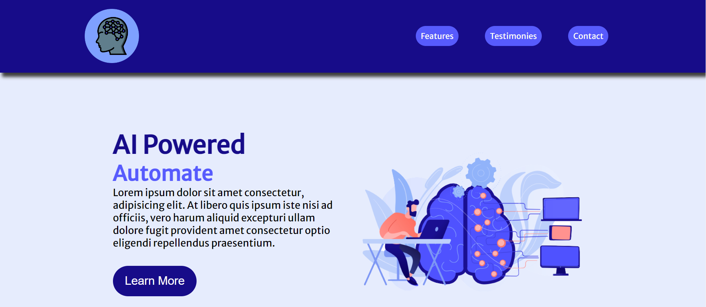

<h1 align="center">Hi, I'm Fabio</h1>
<h3 align="center">A passionate developer</h3>

<ul>
  <li>I have 3 years of professional experience coding in Powershell where I've created tools to automate various tasks and save my orginization time and cost.</li>
  <li>I’m currently learning Web Development (The Odin Project curriculum)</li>
  <li>How to reach me fabio_d89@hotmail.com or find me on LinkedIn https://www.linkedin.com/in/fabio-de-oliveira-43838366/**</li>
</ul>
 

<h1 align="center">Projects</h1>

| "Mock" Landing Page   | Character |
| ---      | ---        |
|   | `         |
| <a href="https://fabiod89.github.io/odin-landing-page/">Live</a> - <a href="https://github.com/fabiod89/odin-landing-page">Source</a>          | \|        |
| Technology Used: HTML, CSS       | \|        |
| A simple landing page demonstrating HTML/CSS Alignment/flexbox concepts| \|        |
