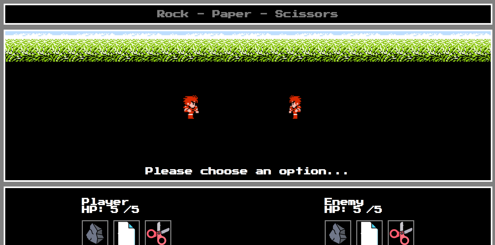

<h1 align="center">Hi, I'm Fabio</h1>
<h3 align="center">A passionate developer</h3>

<ul>
  <li>I have 3 years of professional experience coding in Powershell where I've created tools to automate various tasks and save my orginization time and cost.</li>
  <li>I’m currently learning Web Development (The Odin Project curriculum)</li>
  <li>How to reach me fabio_d89@hotmail.com or find me on LinkedIn https://www.linkedin.com/in/fabio-de-oliveira-43838366/**</li>
</ul>
 

<h1 align="center">Projects</h1>

| "Mock" Landing Page   | Rock Paper Scissors |
| ---                   | ---        |
|   |          |
| <a href="https://fabiod89.github.io/odin-landing-page/">Live</a> - <a href="https://github.com/fabiod89/odin-landing-page">Source</a>          | <a href="https://fabiod89.github.io/Rock-Paper-Scissors//">Live</a> - <a href="https://github.com/fabiod89/Rock-Paper-Scissors">Source</a>      |
| Technology Used: HTML, CSS       | Technology Used: HTML, CSS, Javascript       |
| 
A simple landing page demonstrating

HTML/CSS Alignment/flexbox concepts 
| 
A game of Rock Paper Scissors

inspired by Final Fantasy 1 NES 
     |

| Title         | Title         |
| ------------- | ------------- |
| Image         | Image         |
| Tech Used     | Tech Used  |
| Desc          | Desc  |
